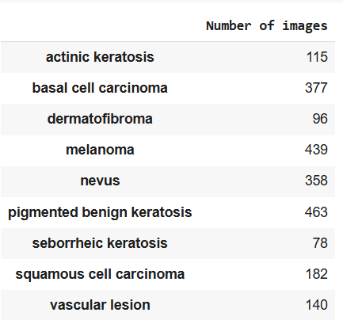
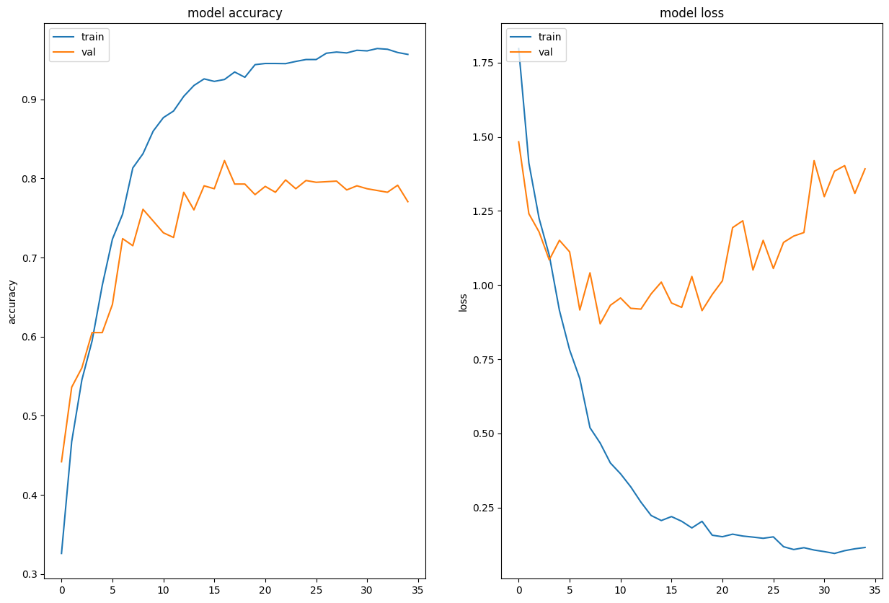

# Project Name
> To build a CNN based model which can accurately detect melanoma. Melanoma is a type of cancer that can be deadly if not detected early. It accounts for 75% of skin cancer deaths. A solution that can evaluate images and alert dermatologists about the presence of melanoma has the potential to reduce a lot of manual effort needed in diagnosis.

## Table of Contents
* [General Info](#general-information)
* [Technologies Used](#technologies-used)
* [Conclusions](#conclusions)
* [Acknowledgements](#acknowledgements)

## General Information
- Project Title: Melanoma-Skin-Cancer-Detection
- Background: This project focuses on leveraging machine learning techniques to accurately detect different types of skin cancer (melanoma and other skin lesions) from images of skin lesions. Early detection of melanoma can significantly reduce mortality rates associated with the disease.
- Business Problem: Skin cancer, particularly melanoma, is one of the most aggressive forms of cancer. Early diagnosis is crucial for effective treatment. This project aims to automate the detection of skin lesions using deep learning models to assist healthcare professionals in diagnosing skin cancer.
- Dataset: The project uses the ISIC (International Skin Imaging Collaboration) dataset, The dataset consists of 2357 images of malignant and benign oncological diseases. All images were sorted according to the classification taken with ISIC, and all subsets were divided into the same number of images, with the exception of melanomas and moles, whose images are slightly dominant.

## Conclusions
- High Model Accuracy: After training the model for 35 epochs, it achieved an accuracy of 95.44% on the training data, indicating strong learning on the given dataset.
- Overfitting Evidence: There was a noticeable gap between training and validation accuracy, suggesting some overfitting to the training data.
- Class Imbalance Impact: The dataset showed class imbalance, with certain classes having significantly fewer samples, which could negatively impact model performance, especially for underrepresented classes.
- Improvement with Data Augmentation: By using the Augmentor library for data augmentation, we aimed to resolve the class imbalance issue and improve generalization, yielding better performance across all classes.

## Technologies Used
- TensorFlow - version 2.18
- Keras - version 3.8
- NumPy - version 2.2.1
- Matplotlib - version 3.10
- Augmentor - version 0.2.12
- Pillow - version 11.1

## Contact
Created by [@Me-HarshitSharma] - feel free to contact me!

